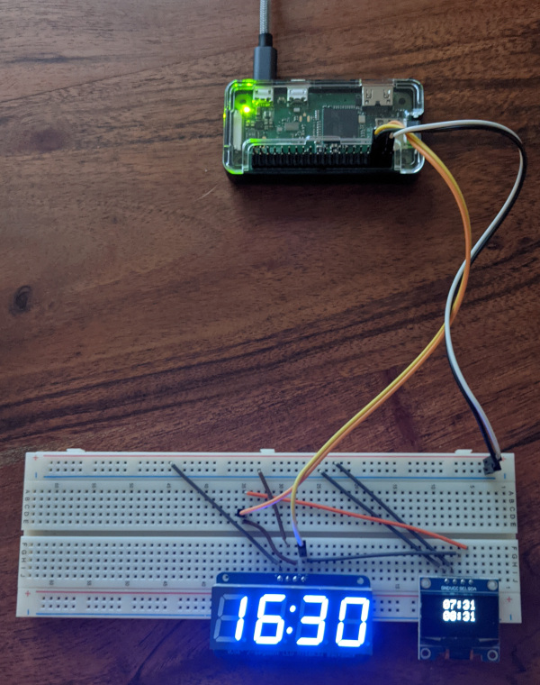

# MBTA countdown
This program creates two displays. One display counts down until the next arrival of the MBTA train/subway while the other screen displays the arrival time.  Created in order to not miss a commuter rail train but expanded to include the subway.

## Requirements
<ul>
<li>Raspberry Pi (zero W). <a href=https://www.adafruit.com/product/3400>Can be purchased here</a></li>
<li>ssd1306 display with I2C connection (SPI would not connect with Rust crates). <a href=https://www.amazon.com/IZOKEE-Display-SSD1306-Raspberry-White-IIC/dp/B076PDVFQD/>Can be purchased here</a></li>
<li>7 segment clock display.  Adafruit 0.56" 4-Digit 7-Segment Display w/I2C Backpack. <a href=https://www.adafruit.com/product/3400>Can be purchased here</a></li>
<li>or tm1637 7 segment clock display. <a href=https://www.aliexpress.com/item/32965437463.html>Can be purchased here</a></li>
<li> Misc. electronics for prototyping: bread board, wiring, multimeter etc.</li>
<li>OpenSSL installed on Raspberry Pi</li>
</ul>

## Connections

### Screen display
<table>
<tr><th>Label</th><th>Desc</th><th>RasPin</th><th>RasDesc</th></tr>
<tr><td>GND</td><td>Ground</td><td>6</td><td>Ground</td></tr>
<tr><td>VCC</td><td>3.3 V</td><td>1</td><td>3.3 Volts</td></tr>
<tr><td>SDA</td><td>I2C SDA</td><td>3</td><td>GPIO2 (SDA)</td></tr>
<tr><td>SCL</td><td>I2C SCL</td><td>5</td><td>GPIO3 (SCL)</td></tr>
</table>

### Clock display
https://learn.adafruit.com/adafruit-led-backpack/0-dot-56-seven-segment-backpack-python-wiring-and-setup
<table>
<tr><th>Label</th><th>Desc</th><th>RasPin</th><th>RasDesc</th></tr>
<tr><td>GND</td><td>Ground</td><td>6</td><td>Ground</td></tr>
<tr><td>VCC</td><td>3.3 V</td><td>1</td><td>3.3 Volts</td></tr>
<tr><td>SDA</td><td>I2C SDA</td><td>3</td><td>GPIO2 (SDA)</td></tr>
<tr><td>SCL</td><td>I2C SCL</td><td>5</td><td>GPIO3 (SCL)</td></tr>
</table>
 Or TM1637 display
<table>
<tr><th>Label</th><th>Desc</th><th>RasPin</th><th>RasDesc</th></tr>
<tr><td>GND</td><td>Ground</td><td>6</td><td>Ground</td></tr>
<tr><td>VCC</td><td>3.3 V</td><td>1</td><td>3.3 Volts</td></tr>
<tr><td>DIO</td><td>Data IO line</td><td>13</td><td>GPIO27</td></tr>
<tr><td>CLK</td><td>Clock line</td><td>15</td><td>GPIO22</td></tr>
</table>

### Shutdown button (optional)
Required: Momentary switch 
Connect GPIO pin 13 through a momentary switch to a 3.3V source.  Add a couple hundred ohm resistor 
to prevent over voltage to pin 13.  Pressing the momentary switch will cleanly shutdown the program 
then shutdown the raspberry pi.

### Power led (optional)
Connect led with appropriate resistor to txio/GPIO14 and ground.

## How to run
`sudo apt-get install libssl-dev` 
`cargo build` or `cargo build --release` 
`./target/target/MBTA_countdown -s <station> -d <direction>`
### WARNING
Takes over 2 hours to compile in --release on Raspberry Pi 0

